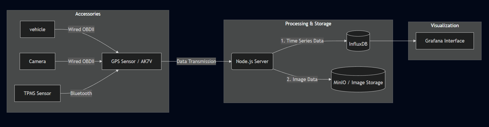
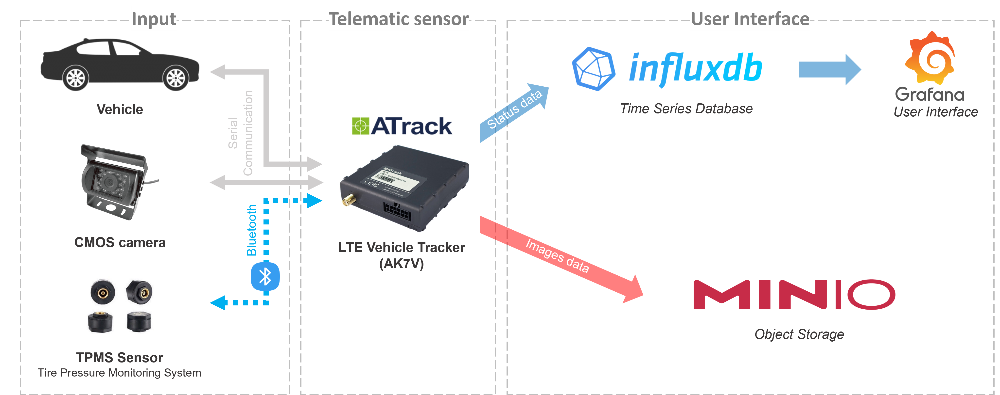
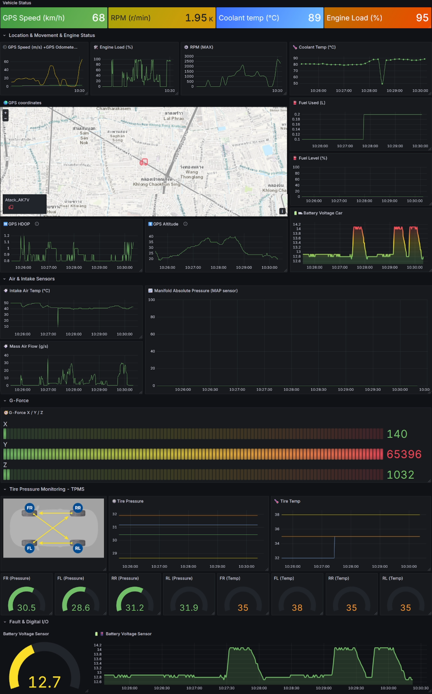

# Atrack AK7V Performance Test Project


### Real-time Monitoring


## Objective
The primary objective of this project is to test the performance of the **Atrack AK7V** telematics device. The system captures real-time data from the device, processes it via a Node.js script, stores it in InfluxDB, and visualizes the results in Grafana.

## System Workflow




## Architecture Design



## Technical Components

1.  **Atrack GPS Server**: Receives telemetry from AK7V, parses it, and writes to InfluxDB.
2.  **GPS Sensor Script**: (Optional) Additional script for benchmarking USB GPS sensors.

## Setup & Configuration

### 1. Prerequisites
-   Node.js v14+
-   InfluxDB (Time-series database)
-   MinIO (Object storage for images)
-   Grafana (Visualization)

### 2. Installation
```bash
npm install
```

### 3. Configuration
Create a `.env` file (based on `example/.example.env`):
```env
PORT=1221
INFLUXDB_SERVER_URL=http://localhost:8086
INFLUXDB_ORG=MyOrg
INFLUXDB_BUCKET=VehicleData
INFLUXDB_TOKEN=my-token
MINIO_ENDPOINT=localhost
MINIO_ACCESS_KEY=minioadmin
MINIO_SECRET_KEY=minioadmin

```

### 4. Running the System
```bash
node main.js
```

### 5. Console Commands
To send AT commands to the AK7V device:
```text
{DeviceID}|{Command}
```
Example: `876521358213|AT$INFO=?`

---

## GPS Sensor Experiment (USB)
For testing standalone GPS sensors:
```bash
node scripts/gps_test.js
```

## Visualization (Grafana)


---
<div align="center">
  <sub>Developed by KNP| Last Updated: Sep 2025</sub>
</div>